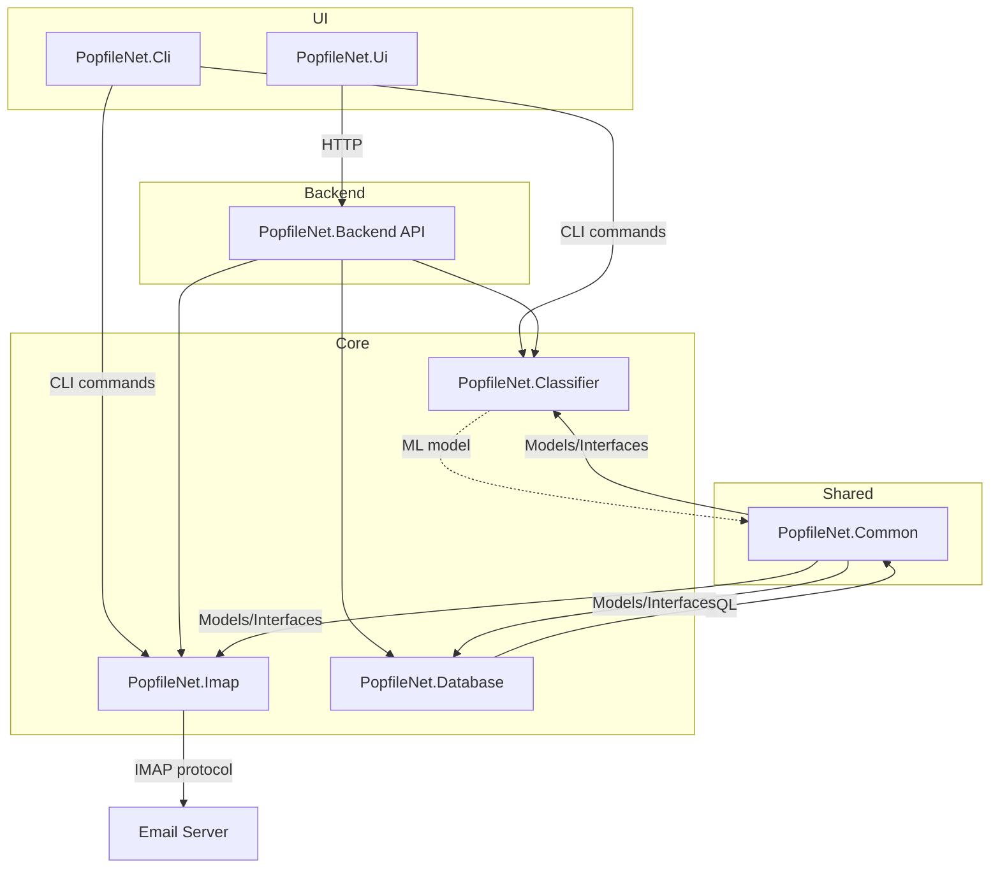

# Architecture

## Overview

PopfileNet is a modular .NET solution for email classification using IMAP and ML.

## Project Structure

```
PopfileNet.sln
├── PopfileNet.Cli/           # CLI entry point
├── PopfileNet.Imap/          # IMAP client layer
├── PopfileNet.Classifier/    # ML classification
├── PopfileNet.Common/        # Shared domain models
├── PopfileNet.Database/      # Data persistence layer
├── PopfileNet.Backend/       # Web API backend
└── PopfileNet.Ui/            # Blazor UI application
```

## Component Diagram



## Core Components

### PopfileNet.Ui

Blazor Server application providing the user interface:
- Settings configuration
- Mail folder sync
- Classifier training and prediction
- Microsoft Fluent UI Blazor components

### PopfileNet.Backend

ASP.NET Core Web API serving the UI:
- Settings endpoints
- Mail operations endpoints
- Classification endpoints

### PopfileNet.Common

Domain models and interfaces:

- `Email` / `IEmail` - Email entity with headers, body, metadata
- `EmailId` - Unique IMAP message identifier
- `MailFolder` / `IMailFolder` - IMAP folder representation
- `Bucket` / `IBucket` - Classification bucket/category
- `MailHeader` - Email header key-value pair

### PopfileNet.Imap

IMAP client using [MailKit](https://github.com/jstedfast/MailKit):

- `ImapClientService` - Main service for IMAP operations
- `IImapClientService` - Service interface
- Connection pooling for parallel email fetching
- Custom exceptions: `ImapConnectionException`, `ImapOperationException`

Key methods:
- `TestConnectionAsync()` - Verify IMAP connectivity
- `FetchEmailIdsAsync()` - Get email UIDs from folder
- `FetchEmailsAsync()` - Download full email content
- `GetAllPersonalFoldersAsync()` - List all mailboxes

### PopfileNet.Classifier

ML.NET-based Naive Bayes classifier:

- `NaiveBayesianClassifier` - ML model training and prediction
- `EmailTrainingData` - Training data schema
- `EmailInput` - Input for prediction
- `EmailPrediction` - Prediction result with confidence scores
- `EmailClassificationDataSet` - Collection of training data

Pipeline:
1. Feature extraction (text featurization)
2. Label encoding
3. Naive Bayes training
4. Prediction with score output

### PopfileNet.Cli

Console application using [System.CommandLine](https://docs.microsoft.com/en-us/dotnet/standard/commandline/) for development testing only:

- `Program.cs` - Entry point with command routing
- `FetchMailsCommand` - Fetch emails from IMAP
- `TestClassifierCommand` - Test ML classification

**Note**: The CLI is for development/testing only. Use the Web UI for production.

## Configuration

`appsettings.json`:
```json
{
  "ImapSettings": {
    "Server": "imap.example.com",
    "Username": "user@example.com",
    "Password": "your-password",
    "Port": 993,
    "UseSsl": true,
    "MaxParallelConnections": 5
  },
  "Classifications": {
    "Category": "Folder"
  }
}
```

## Dependencies

- **MailKit** - IMAP/SMTP client
- **Microsoft.ML** - Machine learning framework
- **Microsoft.Extensions.*** - Configuration, logging, DI
- **System.CommandLine** - CLI framework
- **MimeKit** - MIME parsing
