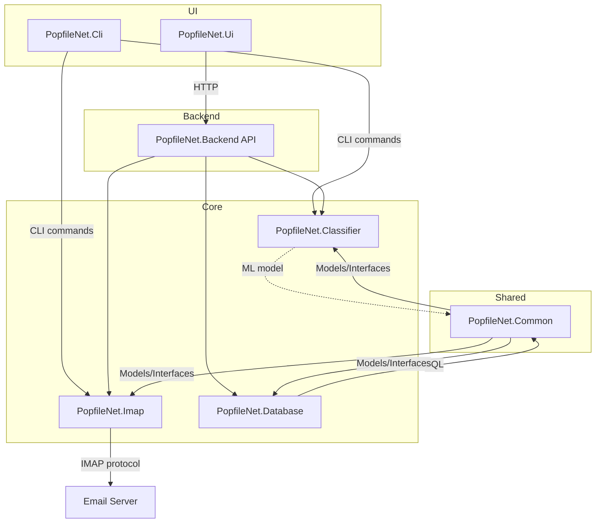

# Architecture

## Overview

PopfileNet is a modular .NET solution for email classification using IMAP and ML.

## Project Structure

```
PopfileNet.sln
├── PopfileNet.Cli/           # CLI entry point
├── PopfileNet.Imap/          # IMAP client layer
├── PopfileNet.Classifier/    # ML classification
├── PopfileNet.Common/        # Shared domain models
├── PopfileNet.Database/      # Data persistence layer
├── PopfileNet.Backend/       # Web API backend
└── PopfileNet.Ui/            # Blazor UI application
```

## Component Diagram


```mermaid
graph TB
    subgraph UI
        CLI[PopfileNet.Cli]
        Blazor[PopfileNet.Ui]
    end

    subgraph Backend
        API[PopfileNet.Backend API]
    end

    subgraph Core
        IMAP[PopfileNet.Imap]
        ML[PopfileNet.Classifier]
        DB[PopfileNet.Database]
    end

    subgraph Shared
        Common[PopfileNet.Common]
    end

    CLI -->|CLI commands| IMAP
    CLI -->|CLI commands| ML
    Blazor -->|HTTP| API
    API --> IMAP
    API --> ML
    API --> DB
    IMAP -->|IMAP protocol| EmailServer[Email Server]
    ML -.->|ML model| Common
    DB -->|SQL| Common
    Common -->|Models/Interfaces| IMAP
    Common -->|Models/Interfaces| ML
    Common -->|Models/Interfaces| DB
```

## Core Components

### PopfileNet.Ui

Blazor Server application providing the user interface:
- Settings configuration
- Mail folder sync
- Classifier training and prediction
- Microsoft Fluent UI Blazor components

### PopfileNet.Backend

ASP.NET Core Web API serving the UI:
- Settings endpoints
- Mail operations endpoints
- Classification endpoints

### PopfileNet.Common

Domain models and interfaces:

- `Email` / `IEmail` - Email entity with headers, body, metadata
- `EmailId` - Unique IMAP message identifier
- `MailFolder` / `IMailFolder` - IMAP folder representation
- `Bucket` / `IBucket` - Classification bucket/category
- `MailHeader` - Email header key-value pair

### PopfileNet.Imap

IMAP client using [MailKit](https://github.com/jstedfast/MailKit):

- `ImapClientService` - Main service for IMAP operations
- `IImapClientService` - Service interface
- Connection pooling for parallel email fetching
- Custom exceptions: `ImapConnectionException`, `ImapOperationException`

Key methods:
- `TestConnectionAsync()` - Verify IMAP connectivity
- `FetchEmailIdsAsync()` - Get email UIDs from folder
- `FetchEmailsAsync()` - Download full email content
- `GetAllPersonalFoldersAsync()` - List all mailboxes

### PopfileNet.Classifier

ML.NET-based Naive Bayes classifier:

- `NaiveBayesianClassifier` - ML model training and prediction
- `EmailTrainingData` - Training data schema
- `EmailInput` - Input for prediction
- `EmailPrediction` - Prediction result with confidence scores
- `EmailClassificationDataSet` - Collection of training data

Pipeline:
1. Feature extraction (text featurization)
2. Label encoding
3. Naive Bayes training
4. Prediction with score output

The classifier supports persistence via `Save(Stream)` / `Load(Stream)` using
ML.NET's native model format, and exposes `IsTrained` and `TrainingSampleCount`.

## Model Persistence & Load-on-Demand

Trained classifier models are persisted so a model survives an application
restart and can be loaded lazily per owner. Models are split into two parts:

- **Blob**: the ML.NET artifact (`model.zip`) written to disk
- **Metadata**: a `ClassifierModels` table in PostgreSQL (one row per owner)

### Disk layout

```
{Classifier:ModelsRoot}/{ownerId}/model.zip
```

`ownerId` is the authenticated user's ID, lowercased and sanitized for the
filesystem. Each owner gets its own sub-directory, which is the foundation for
multi-tenancy: in the future `ApplicationUser.TenantId` (already on the model,
currently unused) can drive the owner key so each tenant keeps separate models.

### Components

- `IClassifierModelStore` (`PopfileNet.Common`) - stream-typed interface for
  saving/opening/querying/deleting a model per owner. It is deliberately free of
  ML.NET types so the storage strategy can be swapped (files+Postgres today,
  object storage later).
- `EntityFrameworkClassifierModelStore` (`PopfileNet.Backend.Services`) - blob
  on disk (temp-file + rename for crash safety), metadata upserted in
  PostgreSQL; blob is rolled back if the metadata write fails.
- `ClassifierManager` (`PopfileNet.Backend.Services`) - the load-on-demand entry
  point. Caches one classifier instance per owner in a `ConcurrentDictionary`,
  each with its own `MLContext` (ML.NET is not thread-safe, so per-owner
  instances with their own contexts are what makes concurrent multi-user
  prediction safe). On a cache miss it reads the metadata row (cheap) and if a
  model exists, loads the blob into a fresh classifier.
- LRU/TTL eviction: the in-memory cache is bounded by `MaxCachedModels`
  (LRU) and `CacheTtl` so idle owners are released without losing data —
  eviction is lossless because the model stays on disk and is re-hydrated on
  the next request.
- `ClassifierGroupExtensions` resolves the owner from the authenticated user's
  `NameIdentifier` claim and routes `/classifier/train`, `/classifier/predict`
  and `/classifier/status` through the store and manager (no static global
  model anymore).

### Configuration

`Classifier` section in `appsettings.json`:

```json
{
  "Classifier": {
    "ModelsRoot": "classifier-models",
    "MaxCachedModels": 16,
    "CacheTtl": "00:20:00"
  }
}
```

`ModelsRoot` is relative to the backend working directory by default; on
deployments it should be an absolute path on a persistent volume (see
DEPLOYMENT.md).

### PopfileNet.Cli

Console application using [System.CommandLine](https://docs.microsoft.com/en-us/dotnet/standard/commandline/) for development testing only:

- `Program.cs` - Entry point with command routing
- `FetchMailsCommand` - Fetch emails from IMAP
- `TestClassifierCommand` - Test ML classification

**Note**: The CLI is for development/testing only. Use the Web UI for production.

## Configuration

`appsettings.json`:
```json
{
  "ImapSettings": {
    "Server": "imap.example.com",
    "Username": "user@example.com",
    "Password": "your-password",
    "Port": 993,
    "UseSsl": true,
    "MaxParallelConnections": 5
  },
  "Classifications": {
    "Category": "Folder"
  }
}
```

## Dependencies

- **MailKit** - IMAP/SMTP client
- **Microsoft.ML** - Machine learning framework
- **Microsoft.Extensions.*** - Configuration, logging, DI
- **System.CommandLine** - CLI framework
- **MimeKit** - MIME parsing
